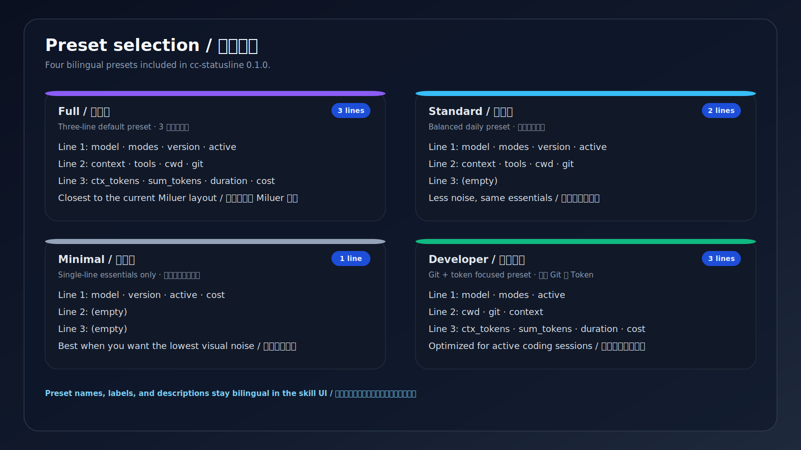
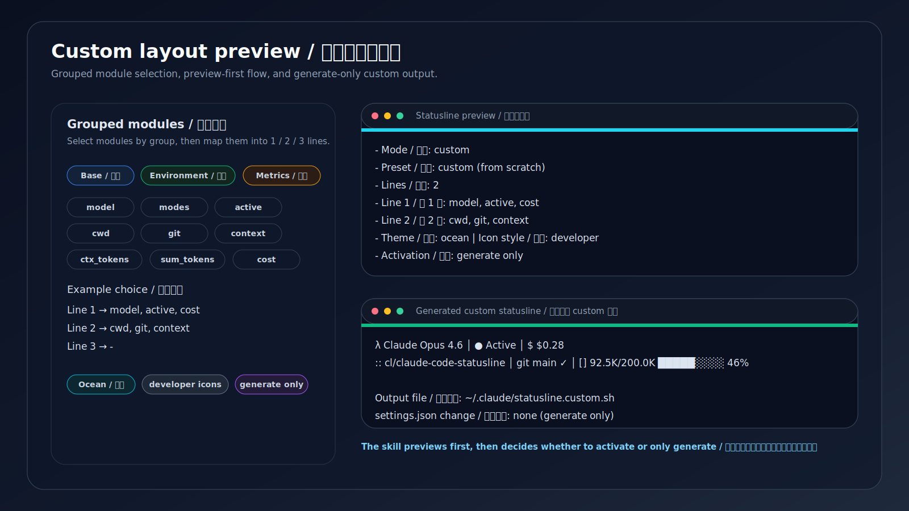
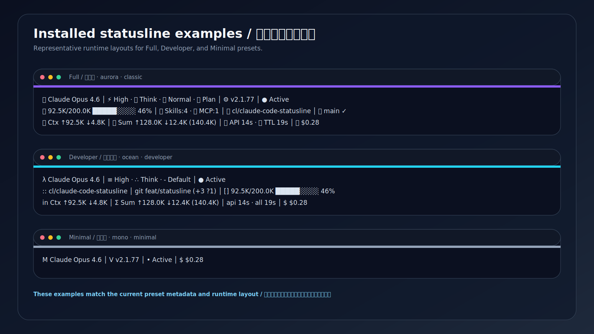
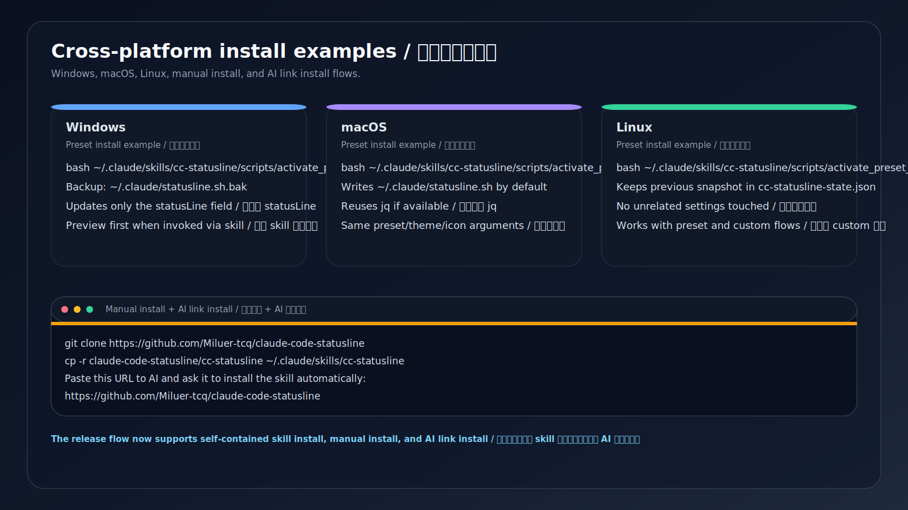

# cc-statusline

> Claude Code 状态栏助手
>
> English README: [README.en.md](README.en.md)

一个支持中英文触发的 Claude Code 状态栏 skill，提供预设安装、先预览后启用、交互式自定义、主题/图标切换，以及 Windows、macOS、Linux 三平台安装支持。

## 一键安装 skill（推荐）
先把仓库作为 marketplace 来源添加到 Claude Code，再安装插件：

```bash
claude plugin marketplace add https://github.com/Miluer-tcq/claude-code-statusline --scope user
claude plugin install cc-statusline@miluer-statusline --scope user
```

说明：
- `--scope user` 表示安装到用户级，也可以按需改成 `project` 或 `local`
- 安装完成后，就可以在 Claude Code 中直接用自然语言触发这个 skill

## 安装后如何一键使用
安装完成后，可以直接在 Claude Code 里输入：

- `帮我一键安装 Full / 完整版 状态栏`
- `帮我切换到 Developer / 开发者版 状态栏`
- `帮我生成一个 2 行自定义状态栏，主题用 ocean，图标用 developer`
- `卸载状态栏，恢复默认状态栏`

## 功能特性
- 覆盖中英文触发表达
- 支持一键安装预设状态栏
- 支持按模块分组生成自定义布局
- 支持从零自定义或从预设微调
- 支持 1 / 2 / 3 行布局
- 支持主题与图标风格切换
- 覆盖安装前会将目标脚本备份到 `<目标路径>.bak`
- 会把旧的 `statusLine` 快照保存到 `~/.claude/cc-statusline-state.json`
- 只修改 `~/.claude/settings.json` 里的 `statusLine` 字段
- 卸载时只移除 `statusLine`，默认保留已生成脚本

## 仓库内容
- `cc-statusline` skill 本体
- 运行时状态栏脚本
- 按平台拆分的安装脚本
- 预设 / 主题 / 图标元数据
- 自定义生成与激活脚本
- 单插件 marketplace 元数据
- 双语发布文档

## 仓库脚本方式
如果你想直接从仓库运行脚本，也可以使用下面的方式。

### 1. 通过脚本启用预设状态栏
推荐入口：
- 统一预设激活入口：`scripts/activate_preset_statusline.sh`
- Windows 安装脚本：`scripts/install_statusline_windows.sh`
- macOS 安装脚本：`scripts/install_statusline_macos.sh`
- Linux 安装脚本：`scripts/install_statusline_linux.sh`

推荐命令：
```bash
bash scripts/activate_preset_statusline.sh full aurora classic
```

预设安装流程会：
- 安装或复用 `jq`
- 将目标脚本备份到 `<目标路径>.bak`
- 把旧的 `statusLine` 值保存到 `~/.claude/cc-statusline-state.json`
- 默认把运行时脚本写入 `~/.claude/statusline.sh`
- 仅修改 `~/.claude/settings.json` 里的 `statusLine` 字段
- 如果检测到外部已有 `statusLine` 配置，会先询问再覆盖

### 2. 生成自定义状态栏
生成三行自定义布局：
```bash
bash cc-statusline/scripts/generate_custom_statusline.sh \
  "$HOME/.claude/statusline.custom.sh" \
  "model,modes,active" \
  "cwd,git,context" \
  "ctx_tokens,sum_tokens,duration,cost" \
  "ocean" \
  "developer"
```

生成单行自定义布局：
```bash
bash cc-statusline/scripts/generate_custom_statusline.sh \
  "$HOME/.claude/statusline.custom.sh" \
  "model,active,cost" \
  "-" \
  "-" \
  "mono" \
  "minimal"
```

说明：
- 每一行使用逗号分隔的模块 id
- 不使用的行传 `-`
- 生成器会输出一份简洁的最终布局摘要

启用生成好的自定义脚本：
```bash
bash scripts/activate_custom_statusline.sh "$HOME/.claude/statusline.custom.sh" ocean developer
```

后续如需切回预设：
```bash
bash scripts/activate_preset_statusline.sh full aurora classic
```

### 3. 卸载 / 恢复默认行为
```bash
bash scripts/uninstall_statusline.sh
```

该脚本只会移除 `~/.claude/settings.json` 中的 `statusLine` 字段。
除非用户明确要求，否则不会删除已生成的脚本文件。

### 4. Marketplace 信息
本仓库已经包含单插件 marketplace 发布所需的 `.claude-plugin/marketplace.json`。

当前元数据：
- 插件名：`cc-statusline`
- marketplace 名称：`miluer-statusline`
- 分支：`main`
- 版本：`0.1.0`

## 预设
- `Full / 完整版` — 最接近当前 Miluer 风格的完整布局
- `Standard / 标准版` — 适合日常使用的均衡布局
- `Minimal / 极简版` — 视觉干扰最低
- `Developer / 开发者版` — 强调 Git 状态与 Token 可见性

## 主题
- `Aurora / 极光`
- `Sunset / 日落`
- `Ocean / 海洋`
- `Mono / 单色`

## 图标风格
- `classic / 经典`
- `minimal / 极简`
- `developer / 开发者`

## 自定义模型
这个 skill 支持：
- 直接选择预设
- 从零开始按分组选择模块
- 先选预设再微调模块
- 选择 1 / 2 / 3 行布局
- 优先选择现有主题，再做颜色微调
- 切换图标风格
- 先生成 `~/.claude/statusline.custom.sh`，再决定是否启用

标准模块分组见 `cc-statusline/references/modules.md`。
触发词示例见 `cc-statusline/references/trigger-phrases.md`。

## 手动安装
详见 `templates/manual-install.md`。

## 截图

### 预设选择 / Preset selection


### 自定义布局预览 / Custom layout preview


### 主题与图标风格 / Themes and icon styles


### 安装后的状态栏示例 / Installed statusline examples


### 三平台安装示例 / Cross-platform install examples


## 仓库结构
详见 `templates/repo-structure.md`。

## 发布清单
详见 `templates/release-checklist.md`。
